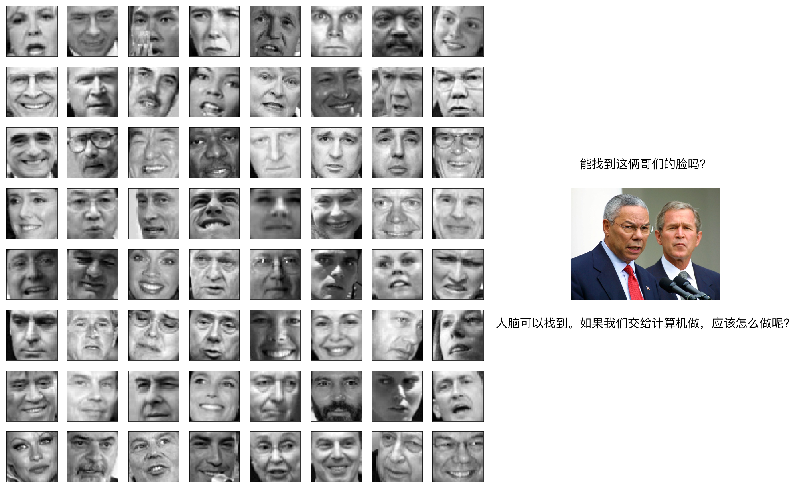
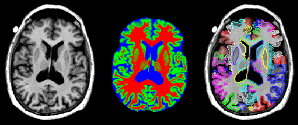
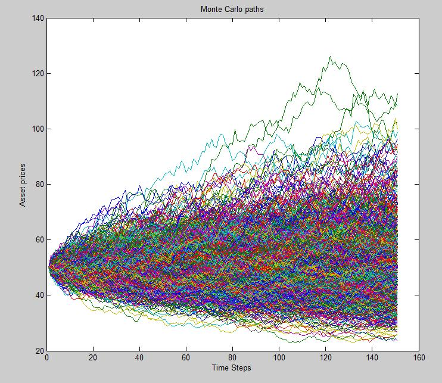

# 机器学习工程化简明提纲

总时长约 8 小时

## 面向对象
1. 人工智能平台工程师（前端与后端）
2. 产品设计
3. Infra 系统工程师和运维工程师
4. 前线

## 目的

|  对象   | 目的  |
|  ----  | ----  |
| AI 平台工程师  | 只有懂得用户的痛点，才能做出解决痛点的产品 |
| 产品设计  | 同上 |
| Infra 系统工程师  | 同上 |
| Infra 运维工程师  | 便于理解 AI 同学使用集群时遇到困难，加速问题定位 |
| 前线  | 对 ML 更深入的理解有助于向客户更好地推荐我们的产品 |

## 特别说明

因为使用人群的差异性，对于特殊的几个章节会出现如下注释：

1. 前：只有前线同事需要看
2. 前略：前线同事请略过此节
3. 前简：前线同事请简单了解即可

## 培训提纲

### 阶段一：一个通用型函数

时长：1 小时到 1.5 小时

#### 第一步：欣赏几个机器学习的例子

##### 1. [人脸识别](https://zh.wikipedia.org/wiki/%E7%89%B9%E5%BE%81%E8%84%B8)

人脸识别是非常常见的一个人工智能应用。我们在杭州东站过身份校验的机器的时候，其实就是将摄像头采集到的我们的人脸和数据库中保存的，也就是我们办身份证时候的人脸做一个比照，看看是不是同一个人。



*人脸识别的方法很多，标题链接点开可以看到其中一种：采用 PCA 的方式*

我们非常简单地介绍一下一下 PCA：Principle Component Analysis


对于一对三位空间内的点，我们找出两个**主要成分**，也就是两个 3 维向量，然后把这些点投影到这两个向量上。这样一来，就可以用某个点在这两个主要向量上投影的值（val_pc1_i, val_pc2_i）来**近似**地表示这个点的实际值：

```
PC1 = (pc1_x, pc1_y, pc1_z)
PC2 = (pc2_x, pc2_y, pc2_z)

(x_i, y_i, z_i) = val_pc1_i * PC1 + val_pc2_i * PC2
                = (val_pc1_i * pc1_x + val_pc2_i * pc2_x,
                   val_pc1_i * pc1_y + val_pc2_i * pc2_y,
                   val_pc1_i * pc1_z + val_pc2_i * pc2_z)
```

##### 2. [CT 图分析](https://zh.wikipedia.org/wiki/%E5%9B%BE%E5%83%8F%E5%88%86%E5%89%B2)

脑科医生每天都要看许多 CT 图。脑科医生数量不足，会让患者等待很久；患者数量庞大，脑科医生工作也非常辛苦。



通过算法，将 CT 图的每个像素标出它属于的组织/部位。这样一来就可以帮助医生预检一些病例，提高效率。

实现的方法有许多，其中一种思路是先扫描 CT 图像并处理：


然后再把处理后的结果还原成一张图，但是每个点都标记了对应的属性：


##### 3. [Twitter Bot 判断](http://www.jcoal.com/hulianwang/20190614_066368.html)

Twitter Bot 是什么？说白了就是 Twitter 上的机器人水军。对照着机器操控的水军发出的消息和正常用户发出的消息，普通人其实很难分别。

但是标题上的链接展示的新闻介绍了一个新的应用程序，只要将 Twitter 用户的文本输入这个程序，程序就可以判断出这个 Twitter 用户背后是真人还是一个程序。

##### 4. 价格预测 [1](https://blog.csdn.net/u014281392/article/details/76202493) [2](https://juejin.im/post/5cdd1c65e51d453c850d3bd4)

跟钱有关的问题，想必大家更感兴趣。

对于价格的预测，一种方法是我们可以提取出一个商品的特征，然后用一个算法来估计未来这个商品的价格；如果这个商品已经开卖了，我们也可以把它的历史价格、交易量等信息放进一个算法里，告诉我们在未来什么时刻，这个商品会是什么价格。

*用布朗运动估计期货价格*



*用 LSTM 根据历史价格预测未来价格*
*https://github.com/NourozR/Stock-Price-Prediction-LSTM*


#### 第二步：机器学习中的“模型”是什么？

1. 回顾一下 **函数** 的定义
2. 上面几个机器学习的模型算 **函数** 吗？[A1-2-2]()
3. 如果是，那么自变量和应变量，在上述几个例子中，分别有是什么？[A1-2-3]()
4. （前简）这样一个函数，你会选择怎样的数学表达呢？有一个选项是：[feed-forward neural network](https://zh.wikipedia.org/wiki/%E4%BA%BA%E5%B7%A5%E7%A5%9E%E7%BB%8F%E7%BD%91%E7%BB%9C) (可以了解一下 nueron 怎么定义的，hidden layer 怎么定义的)
5. （前简）为什么可以用 feed-forward neural network？[universal approximation theorem](https://en.wikipedia.org/wiki/Universal_approximation_theorem) ([万能逼近定理](https://zhuanlan.zhihu.com/p/39030338))
6. （前）发挥一下想象，针对你平时接触到的用户，他们可能会有什么样的场景需要机器学习？
7. （前）你觉得这些机器学习的场景往往都有哪些特征？

### 阶段二：寻找这个函数（前略）

#### 第一步：怎么找？
1. 回忆一下怎么用[待定系数法](https://baike.baidu.com/item/%E5%BE%85%E5%AE%9A%E7%B3%BB%E6%95%B0%E6%B3%95)从一堆点拟合一个函数
2. 现在点不在函数上，回忆一下用[最小二乘法](https://zh.wikipedia.org/wiki/%E6%9C%80%E5%B0%8F%E4%BA%8C%E4%B9%98%E6%B3%95)找最合适的那个函数
3. 现在待定系数好多，解不了，怎么办？猜一个，把点放进去，看看偏了多少，朝着正确的方向调一调（[迭代法](https://zh.wikipedia.org/wiki/%E9%9B%85%E5%8F%AF%E6%AF%94%E6%B3%95)）
4. 现在点好多，能不能把所有点分成 K 批次，每批次 BS 个点，多调几次？[MBGD](https://zh.wikipedia.org/wiki/%E6%A2%AF%E5%BA%A6%E4%B8%8B%E9%99%8D%E6%B3%95)（思考 BS = 1 会怎么样）
5. 是不是把所有的点都用过之后，就一定会找到那个拟合的函数？如果不是，那什么时候停止寻找？
6. 把上面的步骤总结一下：[https://matrices.io/deep-neural-network-from-scratch/](https://matrices.io/deep-neural-network-from-scratch)


#### 第二步：用计算机怎么找？

1. 在 ML 中，那些点是什么？（训练数据）怎么在计算机上准备这些点？
2. 在 DL 中，待拟合的函数是什么？图和权重分别可以类比函数的什么？怎么在计算机上代表这些点？（框架定义图、储存权重）
3. 在 DL 中，每次修改“模型”权重的依据是什么？（框架的自动求导）
4. 根据第一步中的最后总结，想象一下针对 NN 的 SGD 应该怎么做？（框架的优化器）


